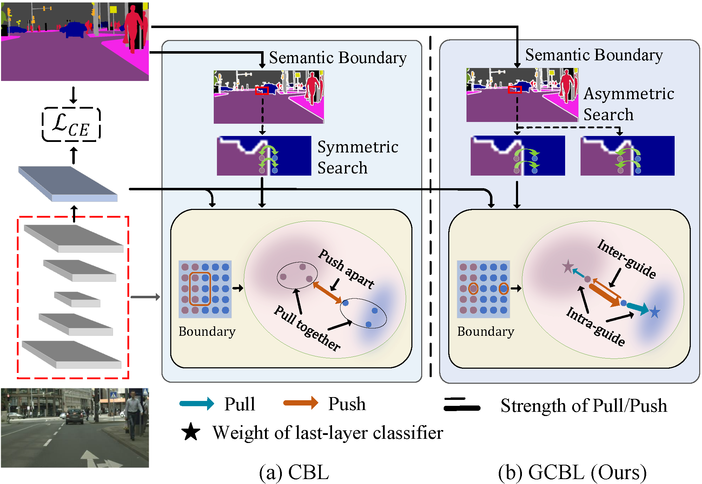
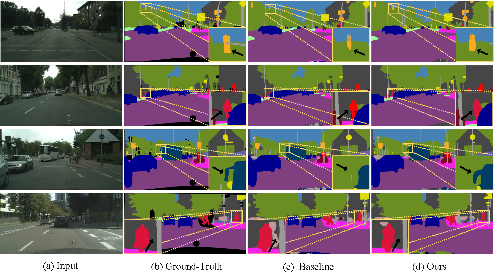

# Official code for our paper:  

<pre>
Guided Contrastive Boundary Learning for Semantic Segmentation
</pre>

### Framework

        

 

### Abstract

Semantic segmentation is a fundamental task for environmental understanding, which aims to classify each pixel in an image into some specific class. Although significant progress has been made in recent years, segmentation results at the boundary area are less than satisfactory. In this paper, we propose a novel guided contrastive boundary learning (GCBL) framework to improve the segmentation performance at boundary areas by enhancing feature representation learning. Unlike the conventional contrastive learning methods, in GCBL, for inter-class distance learning, the contribution of each pixel in contrastive learning is guided through the corresponding probability estimated by the model. For intra-class similarity learning, we use the weights of the last-layer classifiers as a guide and encourage learned representations of each class to be more similar to the corresponding weights based on neural collapse phenomena. We also propose an asymmetric distance boundary pixel search algorithm to make the contrastive pairs selection more reasonable. In addition, to prevent weight collapse in contrastive learning, a distribution regularization is further proposed for the weights of the last-layer classifier. The proposed GCBL method is compatible with other semantic segmentation methods and can serve as an easy plug-in component for existing and future methods. Extensive experiments on the challenging Cityscapes, ADE20K, and S3DIS datasets demonstrate the effectiveness and generalization of our approach.

### Visualization 

        

 
